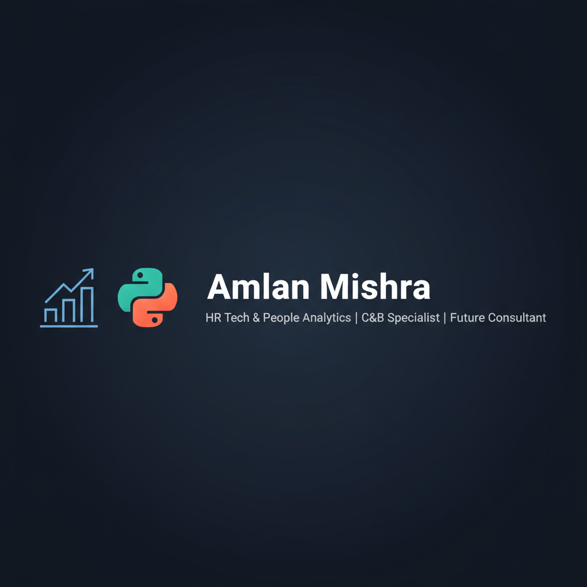

  

---

# Hi, I'm Amlan 👋  

Assistant Manager (C&B & Tech HR) @ KPMG | Building my path into **HR Tech & People Analytics** 🚀  

---

## 🔥 What I’m Working On
- 📊 Building an **HR Analytics Portfolio** with Python & People Analytics concepts  
- 💡 Current project: [Attrition Risk Analyzer](https://github.com/AMBOT-pixel96/hr-tech-portfolio)  
- 🎯 Goal: Transition from HR practitioner → HR Tech consultant  

---

## 🛠️ Tech Stack
  
  
  
  
  

---

## 📌 Featured Project

---

## 🌐 Connect with Me

---

## 📊 GitHub Stats  

  

  

